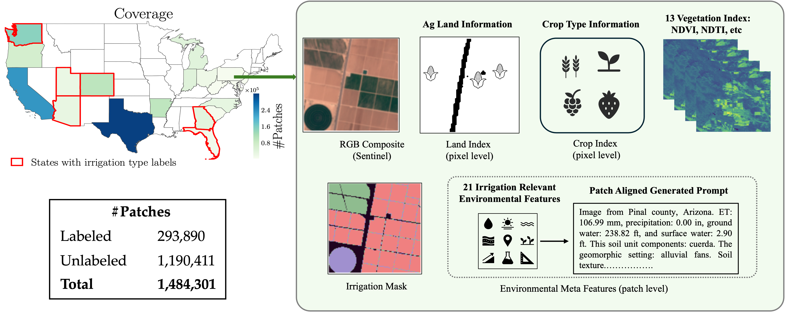
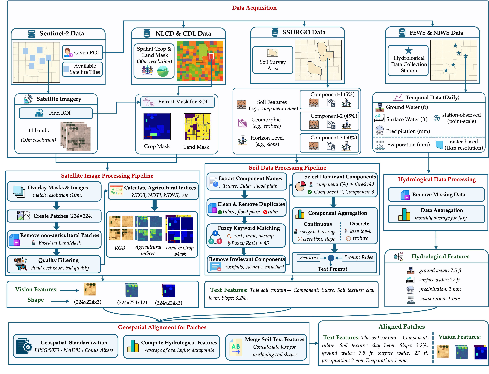
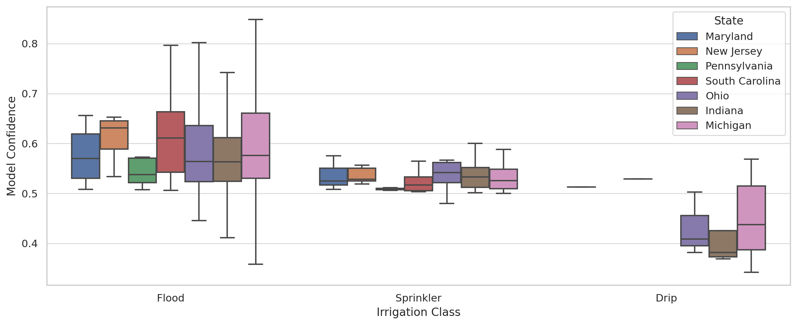
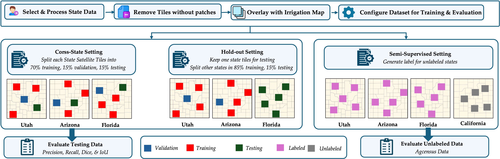

# IRRISIGHT: A Multimodal Remote Sensing Dataset for Irrigation Mapping

**IRRISIGHT** is a large-scale, multimodal remote sensing dataset for irrigation classification, soil-water mapping, and agricultural monitoring. It spans over 20 U.S. states and provides more than 1.4 million ML-ready georeferenced patches with structured text prompts derived from soil, hydrology, land use, and climate data.

---

## 🌍 Overview

This repository supports training and evaluation of irrigation mapping models using:
- Sentinel-2 RGB and vegetation indices
- Crop/land/soil/geospatial metadata
- Vision-language prompts
- Supervised and semi-supervised pipelines

---

## 📦 Hugging Face Dataset

IRRISIGHT dataset is hosted at:  
🔗 https://huggingface.co/datasets/OBH30/IRRISIGHT

Each state directory (e.g., `Arizona/`) contains:
- `metadata.jsonl`: Structured metadata and text prompts
- `*.tar`: WebDataset shards with `.npy` patches and `.json` attributes

To load:
```python
from datasets import load_dataset
ds = load_dataset("NibirMandal/IRRISIGHT", split="train", streaming=True, data_dir="Georgia")
sample = next(iter(ds))
print(sample["__key__"], sample["meta.json"])
```

---

## 📁 Repository Structure

```
IRRISIGHT/
├── Data/                          # WebDataset .tar files and metadata
│   ├── Arizona_0000.tar
│   └── Arizona/metadata.jsonl
├── data/
│   ├── data_module.py             # batch preparation
│   └── dataset_v2.py              # dataset definition
├── config/
│   ├── supervised_training_gpu.yaml
│   └── dumps/                     # teacher/student configs
├── model_v3/                      # CLIP, RemoteCLIP, BLIP, SAM, KIIM, etc.
├── training_v2/                   # Training, label generation, evaluation
├── utils/, Evaluation.ipynb, validation.ipynb
├── requirements.txt, environment.yml
└── README.md
```

---

## ⚙️ Installation

### 1. Clone the repository
```bash
git clone https://github.com/Nibir088/IRRISIGHT.git
cd IRRISIGHT
```

### 2. Create and activate environment
```bash
conda env create -f environment.yml
conda activate irrisight
```

### 3. Install Git LFS (for large files)
```bash
git lfs install
```

---

## 🚀 How to Run

### 🏋️ Train a supervised model
```bash
python training_v2/Training_Teacher_Model-gpu.py hydra.run.dir=outputs/ experiment=supervised_training_gpu
```

### ✨ Generate pseudo-labels for unlabeled data
```bash
python training_v2/Label_Generator_Unlabeled.py +experiment=generate_labels
```

### 📊 Evaluate model performance
```bash
python training_v2/Evaluate_Unlabeled.py +experiment=eval_unlabeled
```

---

## 📊 Sample Benchmark

| Model        | Modalities         | Flood | Sprinkler | Drip |
|--------------|--------------------|--------|------------|------|
| ResNet       | RGB                | 35.2   | 92.2       | 88.5 |
| SegFormer    | RGB                | 86.2   | 91.7       | 85.9 |
| CLIP         | RGB + Text Prompt  | 90.1   | 93.1       | 90.7 |
| RemoteCLIP   | RGB + Text Prompt  | 90.9   | 93.7       | 92.3 |
| **KIIM**     | RGB + Crop + Land  | **93.6** | **95.8** | **94.6** |

---

## 📸 Dataset Visuals

| **Figure** | **Description** | **Image** |
|------------|------------------|-----------|
| **1** | 🔍 *Sample data patch with multimodal inputs including RGB, vegetation indices, and masks.* |  |
| **2** | 🛠️ *End-to-end data processing pipeline for converting raw geospatial data to ML-ready patches.* |  |
| **3** | 📊 *Distribution of model confidence scores across different U.S. states during weak supervision.* |  |
| **4** | 🧪 *Evaluation framework used to test model generalizability across held-out states.* |  |

---

## 📝 License

Released for academic research use only. Contact authors for commercial use.

---

## 📬 Contact

Maintainer: [@Nibir088](https://github.com/Nibir088)  
Dataset: [OBH30/IRRISIGHT on Hugging Face](https://huggingface.co/datasets/OBH30/IRRISIGHT)

